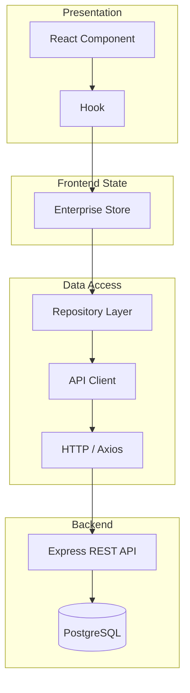

# OPTALYNX Enterprise Architecture

## Overview

OPTALYNX is a React 19 + Vite 8 single-page application using Material UI v9. After Phase B, the frontend operates as one integrated enterprise platform rather than isolated demo modules.

## Architectural Layers

```
┌─────────────────────────────────────────────────────────────┐
│  Pages (route-level views)                                  │
├─────────────────────────────────────────────────────────────┤
│  Module Layouts + Sidebars (AppHeader, AdminNavRail)        │
├─────────────────────────────────────────────────────────────┤
│  Module Hooks (usePlatformConfig, useWorkforcePlanning…)    │
├─────────────────────────────────────────────────────────────┤
│  Enterprise Store (Zustand) — single source of truth        │
├─────────────────────────────────────────────────────────────┤
│  Repository Layer (src/repositories/) — data access         │
├─────────────────────────────────────────────────────────────┤
│  API Clients (src/api/clients/) — transport abstraction     │
├─────────────────────────────────────────────────────────────┤
│  HTTP Client → Express REST API → PostgreSQL                │
├─────────────────────────────────────────────────────────────┤
│  Enterprise Services (events, audit, selectors, visibility) │
└─────────────────────────────────────────────────────────────┘
```

## Core Modules

| Module | Route prefix | Purpose |
|--------|--------------|---------|
| Platform Configuration | `/platform-configuration` | Master config: modules, workflows, budget, notifications, AI, roles |
| Workforce Planning | `/workforce-planning` | Budget requests, approvals, catalogue, exceptions, analytics |
| Business Rules | `/business-rules` | Rule library, designer, approval matrix, simulator |
| Hiring Control Tower | `/hiring-control-tower` | End-to-end hiring lifecycle operations console |

## Shared Design System

Enterprise modules share primitives from `components/platform-config/`:

- `ConfigPageHeader` — page title, breadcrumbs, status chip
- `ConfigSurface` — bordered paper container
- `ConfigMetricSlab` — KPI grid (used across Platform Config, Workforce, HCT)
- `ConfigSaveBar` — publish/discard bar

## Cross-Module Data Flow

1. **Platform Configuration** is the master policy source (modules, thresholds, channels, workflows, role visibility).
2. **Business Rules** and **Workforce Planning** mutate shared store slices directly.
3. **Hiring Control Tower** reads derived state via `buildHiringControlTowerData()` — it never owns duplicate copies of budget thresholds, notification channels, or rule definitions.
4. **Navigation** (`AdminNavRail`, `Home`) reads `platformConfig.modules` and `role_visibility.matrix` for live visibility.

## Event-Driven Integration

Business actions call store mutations, which invoke `publishAudit()`. Audit records propagate to:

- Hiring Control Tower Activity Log
- Workforce Approval Workspace history
- Future backend sync points

Event names follow PascalCase: `BudgetApproved`, `WorkflowPublished`, `ClarificationRequested`.

## Authentication

Auth uses `localStorage` (`token`, `user`). User context feeds audit records via `getCurrentUserContext()` in `enterprise/auditService.js`.

## Backend Integration Readiness

Data flows through a **Repository Layer** (`src/repositories/`) and **API Client Layer** (`src/api/clients/`). Store actions orchestrate mutations by calling repositories; repositories call API clients. In mock mode (`VITE_API_MODE=mock`), clients return seed data. In live mode, clients use Axios against Express REST endpoints.

See [Backend Integration Guide](./Backend%20Integration%20Guide.md) for migration steps.

## Data Flow Diagram


